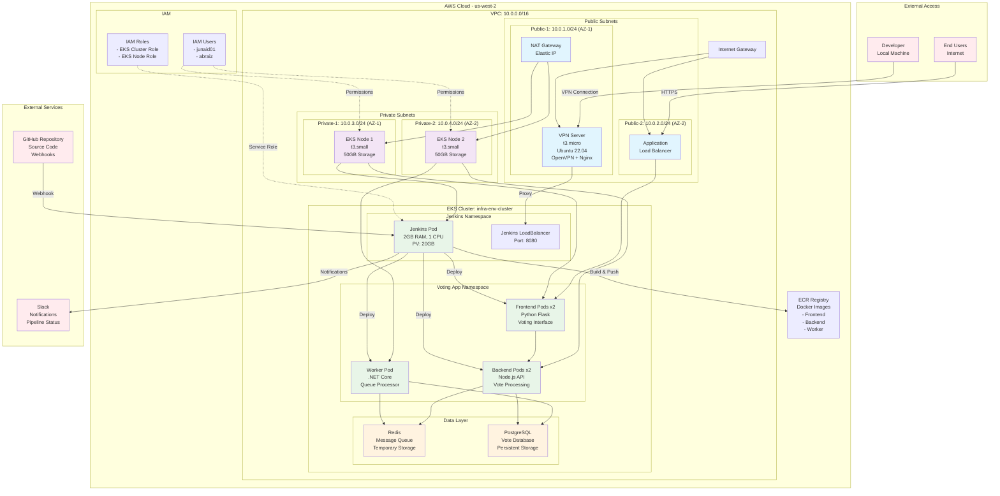
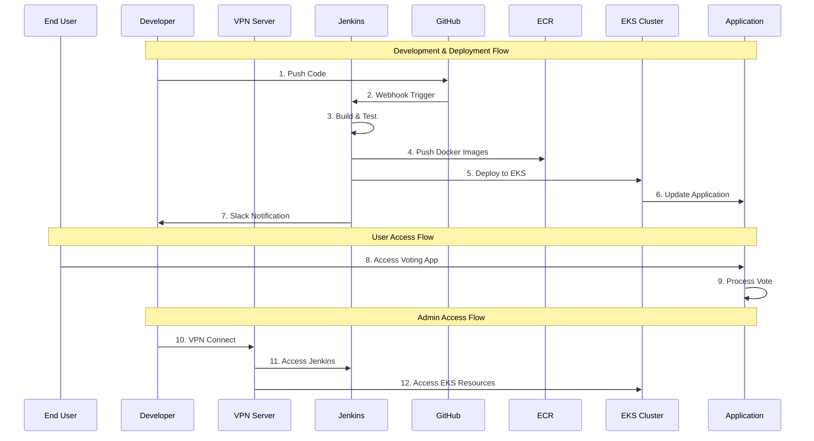
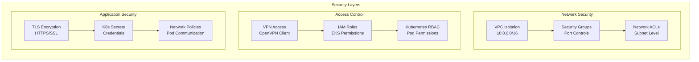
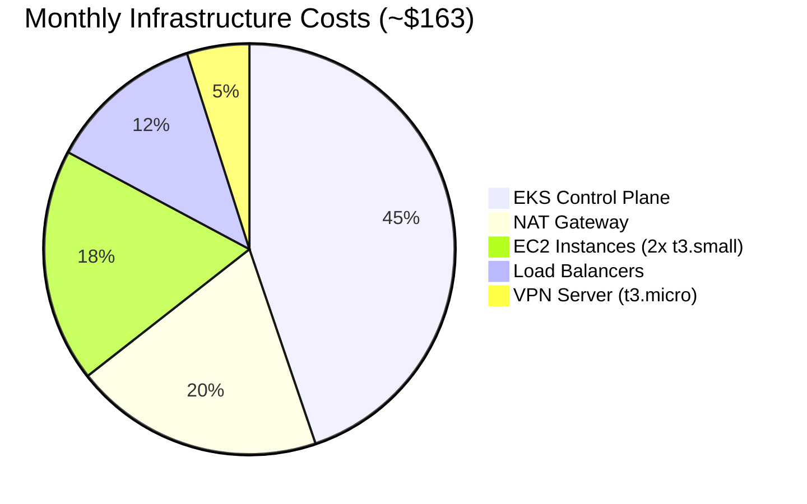

# Infrastructure Architecture Diagram

```mermaid
graph TB
    %% External Users and Developer
    subgraph "External Access"
        EU[End Users<br/>Internet]
        DEV[Developer<br/>Local Machine]
    end

    %% AWS Cloud Infrastructure
    subgraph "AWS Cloud - us-west-2"
        subgraph "VPC: 10.0.0.0/16"
            
            %% Internet Gateway
            IGW[Internet Gateway]
            
            %% Public Subnets
            subgraph "Public Subnets"
                subgraph "Public-1: 10.0.1.0/24 (AZ-1)"
                    VPN[VPN Server<br/>t3.micro<br/>Ubuntu 22.04<br/>OpenVPN + Nginx]
                    NAT[NAT Gateway<br/>Elastic IP]
                end
                
                subgraph "Public-2: 10.0.2.0/24 (AZ-2)"
                    ALB[Application<br/>Load Balancer]
                end
            end
            
            %% Private Subnets
            subgraph "Private Subnets"
                subgraph "Private-1: 10.0.3.0/24 (AZ-1)"
                    NODE1[EKS Node 1<br/>t3.small<br/>50GB Storage]
                end
                
                subgraph "Private-2: 10.0.4.0/24 (AZ-2)"
                    NODE2[EKS Node 2<br/>t3.small<br/>50GB Storage]
                end
            end
            
            %% EKS Cluster
            subgraph "EKS Cluster: infra-env-cluster"
                subgraph "Jenkins Namespace"
                    JENKINS[Jenkins Pod<br/>2GB RAM, 1 CPU<br/>PV: 20GB]
                    JLB[Jenkins LoadBalancer<br/>Port: 8080]
                end
                
                subgraph "Voting App Namespace"
                    FRONTEND[Frontend Pods x2<br/>Python Flask<br/>Voting Interface]
                    BACKEND[Backend Pods x2<br/>Node.js API<br/>Vote Processing]
                    WORKER[Worker Pod<br/>.NET Core<br/>Queue Processor]
                end
                
                subgraph "Data Layer"
                    REDIS[Redis<br/>Message Queue<br/>Temporary Storage]
                    POSTGRES[PostgreSQL<br/>Vote Database<br/>Persistent Storage]
                end
            end
        end
        
        %% ECR Registry
        ECR[ECR Registry<br/>Docker Images<br/>- Frontend<br/>- Backend<br/>- Worker]
        
        %% IAM
        subgraph "IAM"
            USERS[IAM Users<br/>- junaid01<br/>- abraiz]
            ROLES[IAM Roles<br/>- EKS Cluster Role<br/>- EKS Node Role]
        end
    end
    
    %% External Services
    subgraph "External Services"
        GITHUB[GitHub Repository<br/>Source Code<br/>Webhooks]
        SLACK[Slack<br/>Notifications<br/>Pipeline Status]
    end

    %% Connections - External Access
    EU -->|HTTPS| ALB
    DEV -->|VPN Connection| VPN
    
    %% Connections - Network Flow
    IGW --> VPN
    IGW --> ALB
    VPN -->|Proxy| JLB
    ALB --> FRONTEND
    
    %% Connections - Internal Network
    NAT --> NODE1
    NAT --> NODE2
    NODE1 --> JENKINS
    NODE1 --> FRONTEND
    NODE2 --> BACKEND
    NODE2 --> WORKER
    
    %% Connections - Application Flow
    FRONTEND --> BACKEND
    BACKEND --> REDIS
    WORKER --> REDIS
    WORKER --> POSTGRES
    BACKEND --> POSTGRES
    
    %% Connections - CI/CD Flow
    GITHUB -->|Webhook| JENKINS
    JENKINS -->|Build & Push| ECR
    JENKINS -->|Deploy| FRONTEND
    JENKINS -->|Deploy| BACKEND
    JENKINS -->|Deploy| WORKER
    JENKINS -->|Notifications| SLACK
    
    %% Connections - IAM
    USERS -.->|Permissions| NODE1
    USERS -.->|Permissions| NODE2
    ROLES -.->|Service Role| JENKINS

    %% Styling
    classDef publicSubnet fill:#e1f5fe
    classDef privateSubnet fill:#f3e5f5
    classDef eksCluster fill:#e8f5e8
    classDef database fill:#fff3e0
    classDef external fill:#ffebee
    
    class VPN,NAT,ALB publicSubnet
    class NODE1,NODE2 privateSubnet
    class JENKINS,FRONTEND,BACKEND,WORKER eksCluster
    class REDIS,POSTGRES database
    class EU,DEV,GITHUB,SLACK external
```

## Network Flow Diagram

```mermaid
sequenceDiagram
    participant U as End User
    participant D as Developer
    participant V as VPN Server
    participant J as Jenkins
    participant G as GitHub
    participant E as ECR
    participant K as EKS Cluster
    participant A as Application

    Note over D,A: Development & Deployment Flow
    
    D->>G: 1. Push Code
    G->>J: 2. Webhook Trigger
    J->>J: 3. Build & Test
    J->>E: 4. Push Docker Images
    J->>K: 5. Deploy to EKS
    K->>A: 6. Update Application
    J->>D: 7. Slack Notification
    
    Note over U,A: User Access Flow
    
    U->>A: 8. Access Voting App
    A->>A: 9. Process Vote
    
    Note over D,A: Admin Access Flow
    
    D->>V: 10. VPN Connect
    V->>J: 11. Access Jenkins
    V->>K: 12. Access EKS Resources
```

## Security & Access Control

```mermaid
graph LR
    subgraph "Security Layers"
        subgraph "Network Security"
            VPC[VPC Isolation<br/>10.0.0.0/16]
            SG[Security Groups<br/>Port Controls]
            NACL[Network ACLs<br/>Subnet Level]
        end
        
        subgraph "Access Control"
            VPN_ACCESS[VPN Access<br/>OpenVPN Client]
            IAM_ROLES[IAM Roles<br/>EKS Permissions]
            RBAC[Kubernetes RBAC<br/>Pod Permissions]
        end
        
        subgraph "Application Security"
            TLS[TLS Encryption<br/>HTTPS/SSL]
            SECRETS[K8s Secrets<br/>Credentials]
            POLICIES[Network Policies<br/>Pod Communication]
        end
    end
    
    VPC --> SG --> NACL
    VPN_ACCESS --> IAM_ROLES --> RBAC
    TLS --> SECRETS --> POLICIES
```

## Cost Breakdown Visualization

```mermaid
pie title Monthly Infrastructure Costs (~$163)
    "EKS Control Plane" : 73
    "NAT Gateway" : 32
    "EC2 Instances (2x t3.small)" : 30
    "Load Balancers" : 20
    "VPN Server (t3.micro)" : 8
```
